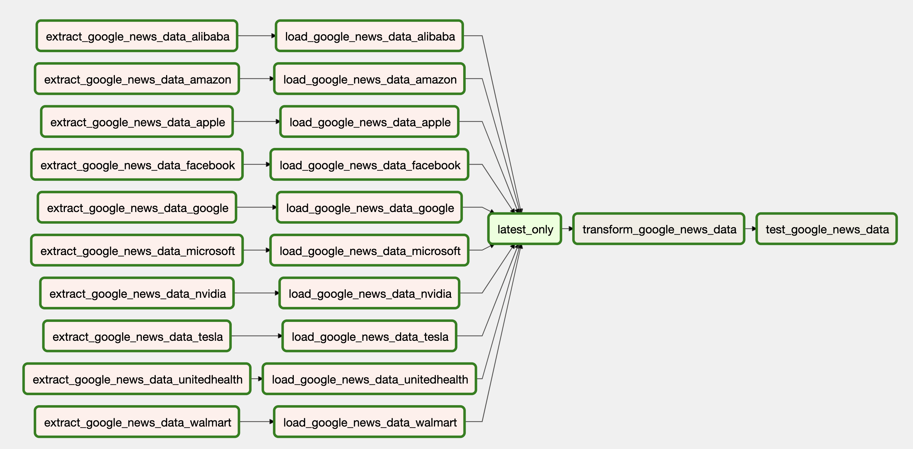
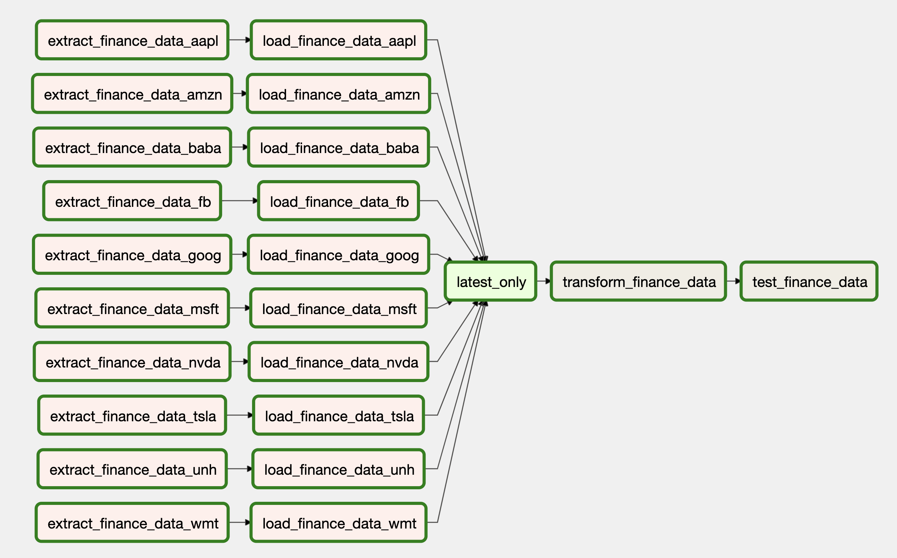

# finance-data-builder

> Finance 🏦 Data Builder 🛠️ @ postgres 🐘

The finance data builder **extracts** data from several sources, **loads** it into a postgres database and 
**transforms** it via dbt into beautiful models.

The data sources are:
* [yahoo! finance](https://finance.yahoo.com/)
* [Google News](https://news.google.com/)

## What it is

### Airflow

I use [Airflow](http://airflow.apache.org/) to **manage** the whole **ELT** process:

For **Google News**:



For **yahoo! finance**:




### DBT

I use [DBT](https://www.getdbt.com/) to **transform** the data into **models**:

```bash dbt graph```

## Get started

### Prerequisites

- [docker](https://www.docker.com/)
- [docker-compose](https://docs.docker.com/compose/)

### Setup

To run this project, simply add a `.env` file to the project root directory, fill it with the following environment 
variables:
```bash
export DBT_POSTGRES_HOST=fdb_dbt_db
export DBT_POSTGRES_USER=dbt
export DBT_POSTGRES_PASSWORD=dbt
export DBT_POSTGRES_DB=dbt
export DBT_POSTGRES_PORT=5432

export AIRFLOW_POSTGRES_HOST=fdb_airflow_db
export AIRFLOW_POSTGRES_USER=airflow
export AIRFLOW_POSTGRES_PASSWORD=airflow
export AIRFLOW_POSTGRES_DB=airflow
export AIRFLOW_POSTGRES_PORT=5432

export AIRFLOW_USER=airflow
export AIRFLOW_PASSWORD=airflow
```
and then run it via `docker-compose`:
```bash
docker-compose up -d
```